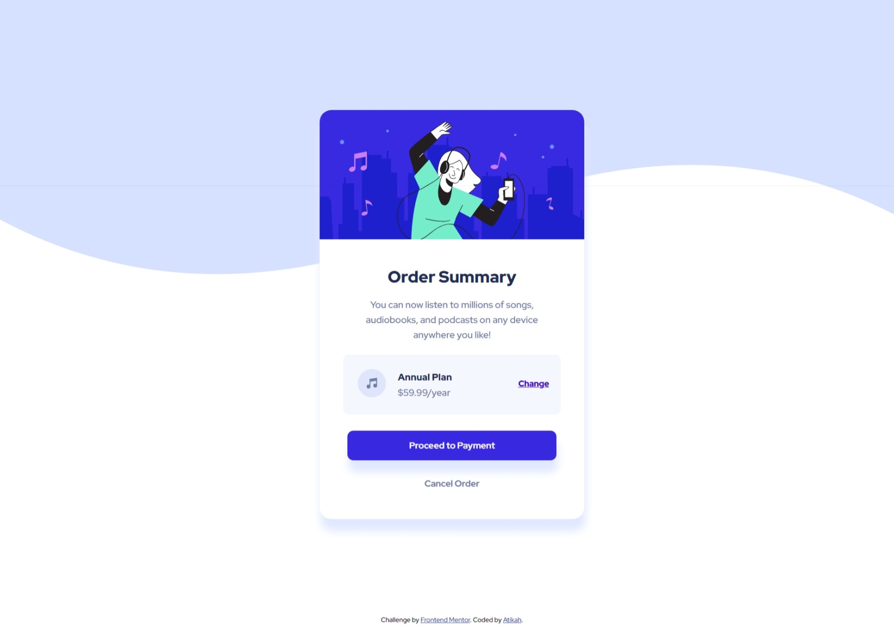

# Frontend Mentor - Order summary card solution

This is a solution to the [Order summary card challenge on Frontend Mentor](https://www.frontendmentor.io/challenges/order-summary-component-QlPmajDUj). Frontend Mentor challenges help you improve your coding skills by building realistic projects. 

## Table of contents

- [Overview](#overview)
  - [The challenge](#the-challenge)
  - [Screenshot](#screenshot)
  - [Links](#links)
- [My process](#my-process)
  - [Built with](#built-with)
  - [What I learned](#what-i-learned)
  - [Useful resources](#useful-resources)
- [Author](#author)

**Note: Delete this note and update the table of contents based on what sections you keep.**

## Overview

### The challenge

Users should be able to:

- See hover states for interactive elements

### Screenshot




### Links

- Solution URL: [solution URL](https://github.com/atikahnaz/order-summary-component-main)
- Live Site URL: [live site URL](https://atikahnaz.github.io/order-summary-component-main/)

## My process

### Built with

- CSS custom properties
- Flexbox


### What I learned

Add footer to the page by using attribution position: absolute and set body position: relative.

```html
<div class="attribution">
    Challenge by <a href="https://www.frontendmentor.io?ref=challenge" target="_blank">Frontend Mentor</a>. 
    Coded by <a href="https://www.frontendmentor.io/profile/atikahnaz">Atikah</a>.
  </div>
```
```css
.attribution { 
  font-size: 11px; 
  text-align: center; 
  position: absolute; 
  bottom: 0;}
```
```css
body {
    font-family: 'Red Hat Display', sans-serif;
    height: 100vh;
    display: flex;
    justify-content: center;
    align-items: center;
    background-image: url('images/pattern-background-desktop.svg');
    background-size: contain;
    background-repeat: no-repeat;
    z-index: -1;
    position: relative;
    padding-top: 150px;
    padding-bottom: 150px;
    
}
```

### Useful resources


## Author

- Frontend Mentor - [@atikahnaz](https://www.frontendmentor.io/profile/atikahnaz)


